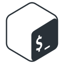

### 🧰 Toolbox
 
  
  
  
 
 
 

- If you want to see my portfolio: https://senemaktas.github.io/ 

 

 

<!--
**senemaktas/senemaktas** is a ✨ _special_ ✨ repository because its `README.md` (this file) appears on your GitHub profile.
-- dark, radical, merko, gruvbox, tokyonight, onedark, cobalt, synthwave, highcontrast, dracula   

  

 -->

<!-- 

 -->
